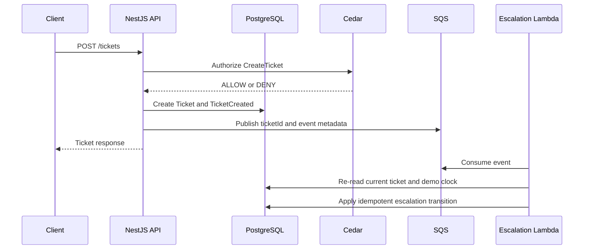

# Tracehold API

[](https://nestjs.com/)
[](https://www.prisma.io/)
[](https://www.postgresql.org/)
[](https://www.cedarpolicy.com/)
[](https://aws.amazon.com/sqs/)


The API is the NestJS application boundary for Tracehold. It owns authentication, transactional ticket state, authorization enforcement, event publishing, historical search integration, evidence generation, and demo-time control.

## Responsibilities

- Authenticate users with JWTs.
- Create and persist maintenance tickets.
- Store chronological ticket events.
- Ask Cedar for protected-action decisions.
- Publish minimal queue events to SQS.
- Read and update the deterministic demo clock.
- Search historical tickets through OpenSearch.
- Generate and retrieve evidence records.

NestJS owns application state. The browser does not connect directly to PostgreSQL, Cedar, SQS, OpenSearch, or the evidence agent.

## Modules

```text
src/
├── auth/             # Login, registration, JWT guard, current user
├── authorization/    # Cedar WASM authorization service
├── aws/              # SQS client and event publishing
├── demo/             # Demo clock and escalation evaluation endpoints
├── events/           # Ticket event publisher
├── evidence/         # Evidence generation and retrieval
├── prisma/           # Prisma client lifecycle
├── properties/       # Property module
├── search/           # OpenSearch ticket and unit history search
├── tickets/          # Ticket CRUD and event timeline
├── units/            # Unit module
└── users/            # User module
```

## Data Model

Prisma/PostgreSQL stores:

- `User`: identity, email, password hash, and role
- `Property`: property name and address
- `Unit`: unit number and property relationship
- `Ticket`: complaint, category, severity, status, creator, assignee, and timestamps
- `TicketEvent`: immutable timeline event type, actor, metadata, and timestamp
- `Evidence`: summary, timeline, related ticket IDs, notice draft, generated time, and model metadata
- `DemoClock`: deterministic demo time

Ticket statuses are:

```text
OPEN
IN_PROGRESS
ESCALATED
EVIDENCE_READY
RESOLVED
CLOSED
```

## API Routes

Authentication:

```text
POST /auth/register
POST /auth/login
GET  /auth/me
```

Tickets:

```text
POST  /tickets
GET   /tickets?status=&unitId=
GET   /tickets/:id
GET   /tickets/:id/events
PATCH /tickets/:id
POST  /tickets/:id/close
```

Search and evidence:

```text
GET  /search/tickets?q=
GET  /units/:id/history
POST /tickets/:id/evidence
GET  /tickets/:id/evidence
```

Demo controls:

```text
GET  /demo/clock
POST /demo/clock
POST /demo/advance-time
POST /demo/escalations/evaluate
```

Health:

```text
GET /health
```

All protected routes use the JWT guard. Cedar remains authoritative for protected operations such as closing tickets, setting demo time, evaluating escalations, and generating evidence.

## Event Flow



The queue payload is intentionally small:

```json
{
  "eventId": "event-id",
  "eventType": "TicketCreated",
  "ticketId": "ticket-id",
  "occurredAt": "2026-09-20T12:00:00.000Z"
}
```

The Lambda worker does not trust stale ticket state from the message. It reads the current database state before transitioning a ticket.

## Configuration

API environment variables are loaded from the repository root `.env` and `apps/api/.env`.

| Variable | Purpose |
|---|---|
| `PORT` | API port, normally `3001` |
| `DATABASE_URL` | PostgreSQL connection string |
| `JWT_SECRET` | JWT signing secret |
| `OPENSEARCH_URL` | OpenSearch URL, normally `http://localhost:9200` |
| `AWS_REGION` | AWS/LocalStack region |
| `AWS_ENDPOINT_URL` | LocalStack endpoint, normally `http://localhost:4566` |
| `SQS_QUEUE_NAME` | Queue name, normally `tracehold-events` |
| `ESCALATION_SLA_HOURS` | Configured escalation SLA |

Never commit real credentials or production secrets.

## Local Development

From the repository root:

```powershell
pnpm install
pnpm infra:up
pnpm prisma migrate deploy
pnpm prisma:seed
pnpm --filter api start:dev
```

The API listens on `http://localhost:3001`.

## Testing and Build

From the repository root:

```powershell
pnpm --filter api lint
pnpm --filter api build
pnpm --filter api test
pnpm --filter api test:e2e
```

The API tests cover authentication, tickets, search, evidence, demo clock behavior, authorization, and event publishing.

## Failure Boundaries

- Ticket state is persisted before asynchronous processing.
- OpenSearch indexing failure does not replace PostgreSQL state.
- Evidence generation failures must not corrupt tickets or timelines.
- Cedar denial must fail closed.
- Replayed escalation messages must not create duplicate transitions.

## Related Documentation

- Root overview: `../../README.md`
- Architecture: `../../docs/ARCHITECTURE.md`
- Product requirements: `../../docs/PRD.md`
- Implementation order: `../../docs/STEPS.md`
- Database schema: `../../prisma/schema.prisma`
- Escalation worker: `../../services/escalation/README.md`
