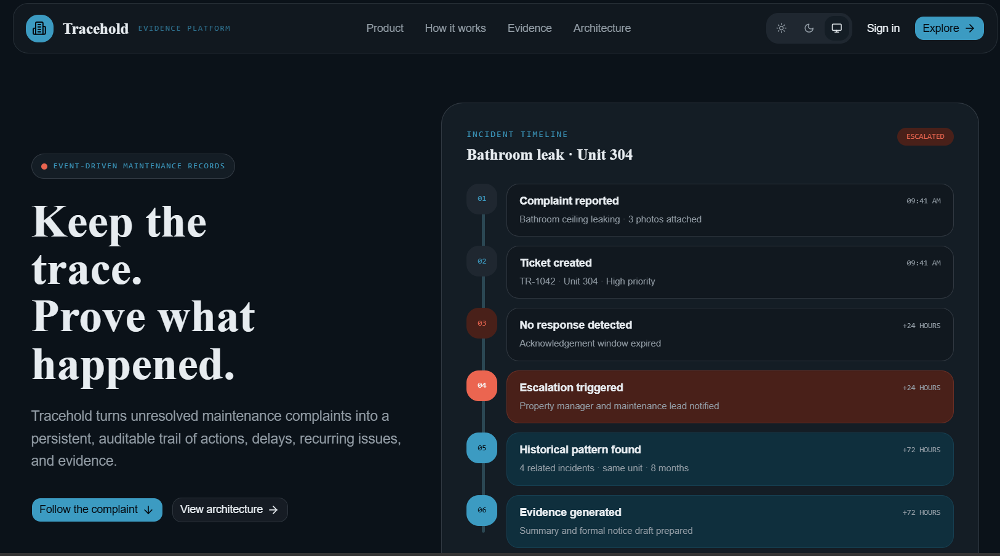
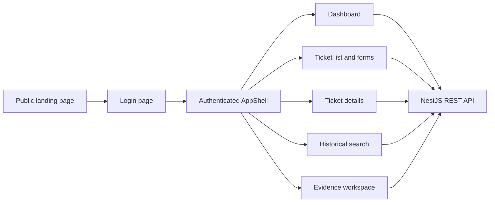
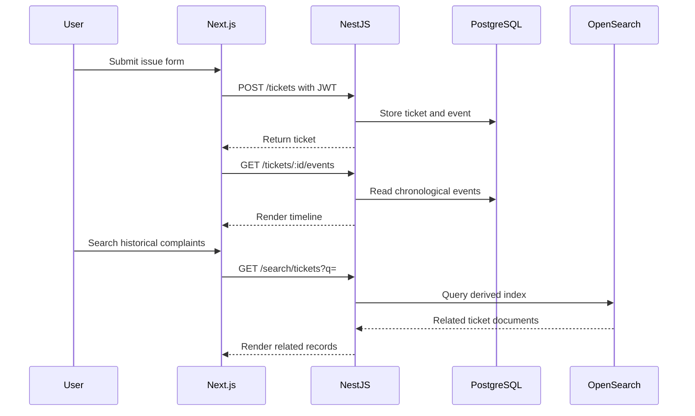

# Tracehold Web

[](https://nextjs.org/)
[](https://www.typescriptlang.org/)
[](https://tailwindcss.com/)
[](https://lucide.dev/)



The web application is the Next.js interface for Tracehold. It contains the public product landing page and the authenticated maintenance workspace used to create tickets, inspect timelines, search historical complaints, control deterministic demo time, and review evidence drafts.

## Routes

| Route | Description | Authentication |
|---|---|---|
| `/` | Public Tracehold landing page | Public |
| `/login` | JWT login form | Public |
| `/dashboard` | Workspace overview and demo controls | Required |
| `/tickets` | Ticket table and status overview | Required |
| `/tickets/new` | Maintenance issue form | Required |
| `/tickets/[id]` | Ticket record, events, and evidence | Required |
| `/history` | Historical complaint search | Required |
| `/evidence` | Evidence workspace | Required |

## Frontend Architecture



## Shared Workspace Shell

Authenticated pages use `components/workspace/app-shell.tsx`, which provides:

- Persistent desktop sidebar
- Responsive mobile navigation
- Overview, Tickets, History, and Evidence links
- Create issue action
- Current user identity and role
- Sign out
- Sticky header
- Light, dark, and system theme switcher

The landing page has its own public shell and should remain visually distinct while sharing the same theme tokens.

## Data Flow



The browser never connects directly to PostgreSQL, OpenSearch, SQS, Lambda, Cedar, or the Python agent.

## Theme and Styling

Global styling lives in `styles/globals.css` and is imported by `app/layout.tsx`.

Use its semantic tokens rather than hardcoded page-specific colors:

- `bg-background`, `text-foreground`
- `bg-card`, `bg-surface`, `bg-nav`
- `text-primary`, `bg-primary`
- `text-signal`, `bg-signal-soft`
- `border-border`, `text-muted-foreground`
- `shadow-clay`, `shadow-clay-sm`, `shadow-ink`
- `font-display`, `font-mono`

The visual language is a warm, document-like evidence workspace with rounded cards, restrained shadows, clear timelines, and strong status labels.

## Authentication

Login sends:

```text
POST http://localhost:3001/auth/login
```

The response token and safe user summary are stored through `lib/api.ts`:

- `tracehold_token`
- `tracehold_user`

Passwords and application records are not stored in browser storage.

Successful login redirects to `/dashboard`.

## API Client

`lib/api.ts` provides:

- `API_URL` from `NEXT_PUBLIC_API_URL`
- `apiFetch` for JSON requests
- automatic Bearer token attachment
- `ApiError` with HTTP status
- session helpers
- shared frontend ticket and event types

Default local API configuration:

```text
NEXT_PUBLIC_API_URL=http://localhost:3001
```

## Local Development

Start infrastructure and the API from the repository root:

```powershell
pnpm infra:up
pnpm prisma migrate deploy
pnpm prisma:seed
pnpm --filter api start:dev
```

Then start the web application in another terminal:

```powershell
pnpm --filter web dev
```

Open `http://localhost:3000`.

## Demo Flow

1. Open `/login`.
2. Use `tenant@tracehold.local` and `tracehold-demo-tenant`.
3. Create a ticket from `Create issue`.
4. Open the ticket from `/tickets`.
5. Inspect the `TicketCreated` event.
6. Use an admin account for demo-clock controls.
7. Advance time through `/dashboard`.
8. Search related complaints through `/history`.
9. Generate and inspect evidence through the ticket details page or `/evidence`.

Demo accounts are seeded by `prisma/seed.ts`:

| Role | Email | Password |
|---|---|---|
| Tenant | `tenant@tracehold.local` | `tracehold-demo-tenant` |
| Contractor | `contractor@tracehold.local` | `tracehold-demo-contractor` |
| Landlord | `landlord@tracehold.local` | `tracehold-demo-landlord` |
| Admin | `admin@tracehold.local` | `tracehold-demo-admin` |

## Component Areas

```text
app/
├── dashboard/            # Authenticated overview
├── evidence/             # Evidence workspace
├── history/              # Historical search
├── login/                # Authentication
├── tickets/              # Ticket list, create, and detail pages
├── globals.css           # Semantic theme tokens and utilities
└── page.tsx              # Public landing route

components/
├── landing/              # Public landing sections and theme switcher
├── workspace/            # Authenticated shell
├── ui/                   # Reusable UI primitives
└── ticket-status.tsx     # Shared ticket status badge
```

## Testing and Build

From `apps/web`:

```powershell
npm run lint
npm run build
```

From the repository root:

```powershell
pnpm build
```

When running a production build, stop the active `next dev` process first so both processes do not write to the same `.next` directory.

## UI State Requirements

Pages should explicitly handle:

- Loading
- Empty results
- Unauthorized `401`
- Forbidden `403`
- Missing records `404`
- API/network failure
- Evidence generation failure without hiding the ticket timeline

Status must be communicated through text and not color alone.

## Related Documentation

- Root overview: `../../README.md`
- UI/UX blueprint: `../../docs/FRONTEND-UI-UX.md`
- Product requirements: `../../docs/PRD.md`
- Architecture: `../../docs/ARCHITECTURE.md`
- Implementation order: `../../docs/STEPS.md`
- API service: `../api/README.md`
